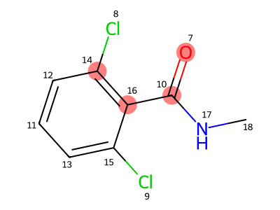
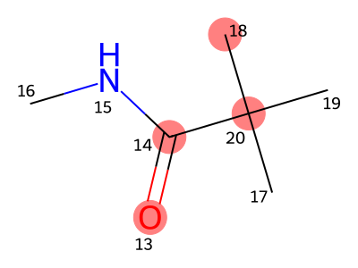
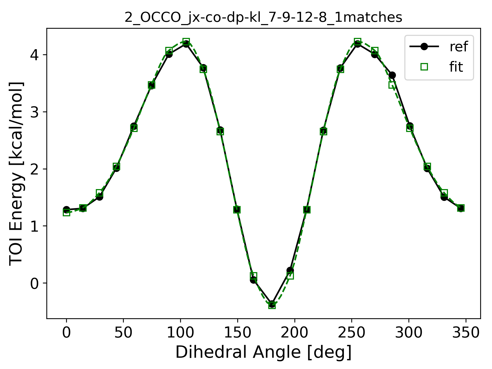

# Why is torsion fit ill-posed?

The bespoke torsion fitting aligns MM energies with QM energies across a range of conformers with varying torsion angles.

$$
E_{\text{MM}} (\theta)= E_{\text{QM}}(\theta) + c
$$

Here $c$ is a constant.

We can single out the torsion energy term

$$
E_{\text{torsion}}(\theta)=E_{\text{QM}}(\theta)- E_{\text{other-MM}} + c \equiv E_{d}(\theta) +c
$$

Here $E_d(\theta)$ amounts to measured data point.

The torsion energy takes harmonic expansion form.

$$
E_{\text{torsion}}(\theta)=\sum_{i=1}^4 k_i(1+\cos(i\theta-\phi_i))
$$

For simplicity, we will drop all the constant terms and call it $E_t(\theta)$.

## special cases with symmetries

Here symmetries refer to point group symmetries, which fix the differences
between torsion angles of different torsion matches.
Topological equivalence alone does not fix these differences.
It only fixes the relative torsion angle to be some arbitrary value.
Take 2 equivalent end atoms for example

$$
E_t(\theta) = 2\sum_{i=1}^4  k_i\cos\left(i\theta -\phi_i + \frac{i\Delta}{2}\right) \cos\left(\frac{i\Delta}{2}\right)
$$

### 2-fold symmetry

This can occur for example when a benzene ring and the exocyclic bond (atoms 2-3)
is part of the torsion.

$$
E_t(\theta) = 2 [ k_2\cos(2\theta -\phi_2) + k_4\cos(4\theta-\phi_4) ]
$$

### 3-fold symmetry

This can occur for example when CF3 group is part of the torsion.

$$
E_t(\theta) = 3  k_3\cos(3\theta -\phi_3)
$$

### mirror symmetry

If we do a mirror operation about the plane of torsion atoms 1-2-3, we change
the sign of the torsion angle $\theta$. It should not change the torsion energy,
thus we have a general symmetry

$$
E_t(\theta) = E_t(-\theta), \forall \theta
$$

In the TOI energy plot, it shows up as a reflection symmetry at $\theta=0$, see below.

It also gives rise to another reflection symmetry at $\theta=\pi$ in the torsion energy plot

$$
E_t(\pi + \theta) = E_t(-\pi-\theta)= E_t(\pi-\theta)
$$

This mirror symmetry put constraints on the phase choices of the various harmonics.
$\phi_i \in \{0, \pi\}$ for all $i=1\ldots4$.

## coupled torsions

If two rotatable bonds are adjacent (sharing a common atom), the corresponding
torsions can be hard to fit because all the conformations in the torsion scans
are highly correlated.

In this case, we can use a QM relaxed structure and require that structure to be
at energy minimum of the bespoke FF.

$$
\frac{\partial}{\partial\theta}E_{\text{torsion}}(\theta)=-\sum_{i=1}^4 ik_i\sin(i\theta-\phi_i))
$$

## open questions

- If two torsions of different types go into a benzene ring, should they share
  the same torsion parameters and only the 3rd harmonic?
